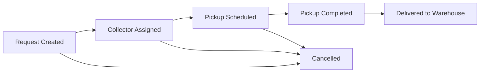

# Technical Architecture

## Recommended Prototype Stack

### Frontend

- React or Next.js for a responsive web app.
- Mobile-first layouts for generator and collector flows.
- Admin dashboard optimized for desktop.
- Browser geolocation API for location capture.
- Standard file input or camera capture for photos.

### Backend

- Node.js API, Next.js API routes, or Supabase.
- PostgreSQL for structured request, assignment, and delivery data.
- Object storage for photos.
- Auth with phone OTP if available; password or mocked OTP is acceptable for an investor demo.

### Realtime

- Realtime subscriptions or polling for request status updates.
- Generators should see status changes after admin assignment, pickup completion, and warehouse delivery.

## Main Modules

### Authentication

Responsibilities:
- Sign up users.
- Sign in users.
- Route users by role.
- Protect generator, collector, and admin screens.

### Generator Request Module

Responsibilities:
- Store generator profiles.
- Create pickup requests.
- Upload request photos.
- Show request history and status timeline.

### Collector Operations Module

Responsibilities:
- List assigned pickups.
- Show pickup details.
- Open map navigation.
- Submit pickup completion logs.
- Submit warehouse delivery confirmations.

### Admin Operations Module

Responsibilities:
- List all requests.
- Assign collectors.
- Schedule pickups.
- Monitor status.
- Review pickup and delivery logs.

### Storage Module

Responsibilities:
- Save uploaded images.
- Return stable photo URLs.
- Associate each photo with a request, assignment, and upload purpose.

## Status Flow

## Key API Endpoints

### Auth and Profiles

- `POST /auth/signup`
- `POST /auth/login`
- `GET /me`
- `PUT /profiles/generator`
- `PUT /profiles/collector`

### Generator Requests

- `POST /waste-requests`
- `GET /waste-requests`
- `GET /waste-requests/:id`
- `POST /waste-requests/:id/photos`
- `POST /waste-requests/:id/cancel`

### Collector Assignments

- `GET /collector/assignments`
- `GET /collector/assignments/:id`
- `POST /collector/assignments/:id/complete-pickup`
- `POST /collector/assignments/:id/deliver-to-warehouse`

### Admin

- `GET /admin/requests`
- `POST /admin/requests/:id/assign`
- `POST /admin/assignments/:id/schedule`
- `GET /admin/assignments/:id`

## Minimal Demo Data

Seed the prototype with:
- Three generator users: tailor, temple, household.
- Two collector users: one bike, one van.
- One admin user.
- One warehouse.
- Five waste requests across different statuses.

## Build Order

1. Create static responsive screens with local mock data.
2. Add auth role routing.
3. Add database schema.
4. Connect generator request creation.
5. Connect collector assignment and completion forms.
6. Connect admin assignment workflow.
7. Add photo upload.
8. Add realtime status updates or polling.

